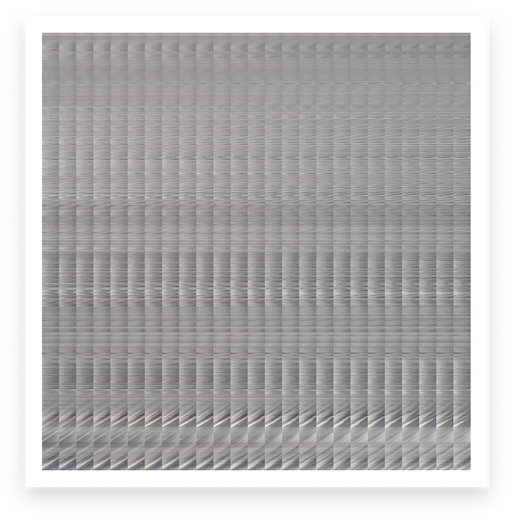

# Sun Eye
Collection of Machine Learning algorithms and tools used for hyperlocal weather prediction

Each folder contains a different project

## How to use

- Install requirements.txt in each project before running with `pip install -r requirements.txt`

## :cloud: Feature Detection


Analyze clouds and cloudiness from a stream of images or video.
 - Returns number of clouds and cloudiness factor in JSON format
 - Supports MP4 and static images (JPEG, PNG).
 - Hypnotizing visualizations during analysis

## :bento: Mosaic Generator

Convert a time lapsed image collection


Into a single image strip that contains the complete time lapse


 - Used for training Convolutional Neural Nets
 - Mesmerizing images, put it on your wall. wow.

## Algorithms

### Caclculate cloud height from relative humidity and temperature
```
T_x = Temperature of x
h_clouds = height of clouds
T_dp = dew point
RH = relative humidity
```


### Calculating width of viewport in meters
```
c = altitude of clouds (m)
z = width of viewport at clouds altitude (m)
alpha = focal view angle of camera (deg)
```

}{2})
